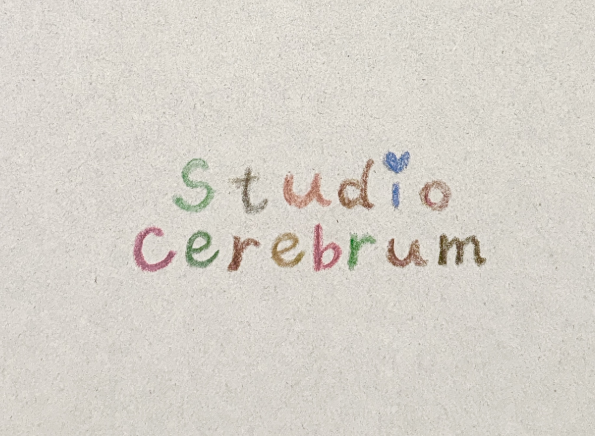
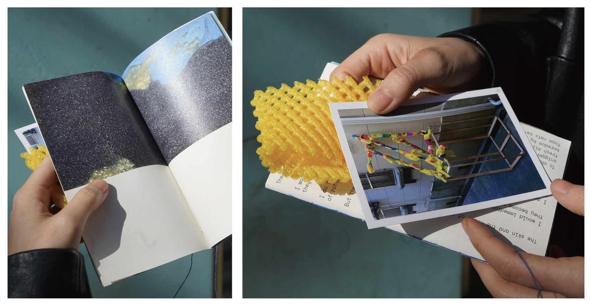
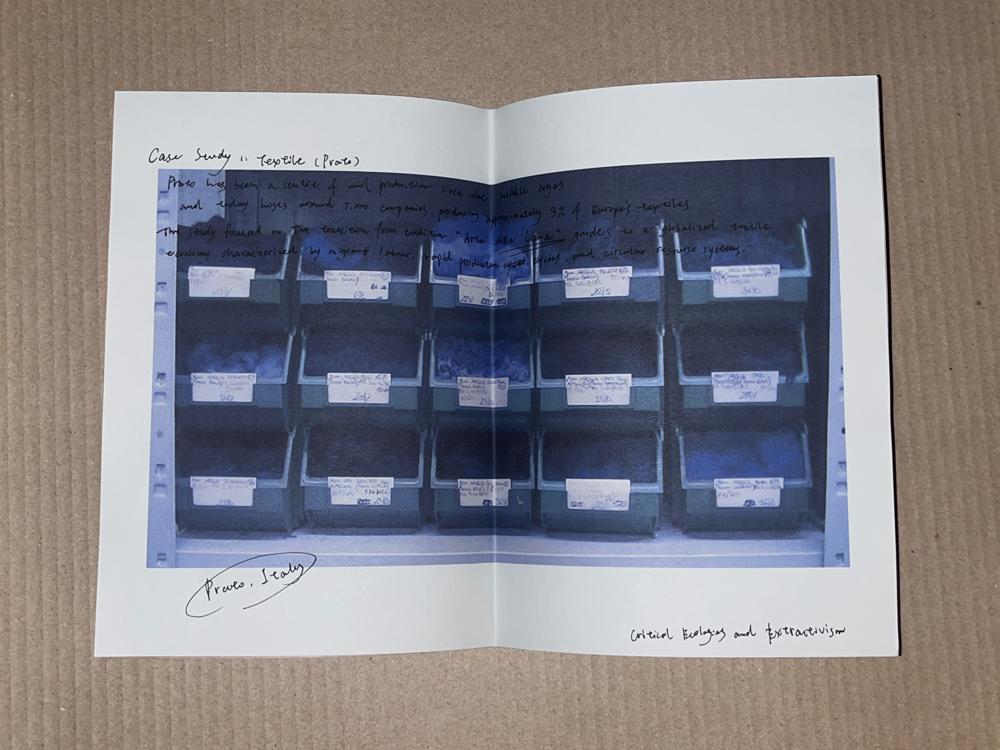

# AI-DLC Instruction Document — Studio Cerebrum Landing Page

> **Purpose of this file:** This is the single source of truth for an AI coding agent (or a human) to build, deploy, and publish the **Studio Cerebrum** landing page (LP) — from an empty folder (0) all the way to a live site on **GitHub Pages** with a **custom domain registered at Onamae.com**.
>
> Read this entire document before writing any code. Follow it top to bottom. Do not invent scope. Do not add features not described here.

---

## 0. Project Summary

| Field | Value |
|---|---|
| Project name | `studio-cerebrum-lp` |
| Deliverable | A single-page, static landing page (LP) |
| Tech stack | Plain HTML + CSS + minimal vanilla JS. **No frameworks, no build step.** |
| Hosting | GitHub Pages |
| Domain registrar | Onamae.com (お名前.com) |
| Design reference | https://www.ok-rm.co.uk (OK-RM, London) |
| Aesthetic | Artsy / editorial / gallery-like, but **clean** and built on **one easy-to-grasp concept** |

### The one concept (state it, then honor it everywhere)
**"A studio as a slow gallery."** The page behaves like a quiet exhibition: a large statement, a slideshow of works, and a long reflective text — nothing more. Everything else is whitespace. This is the OK-RM idea distilled: *attitude becomes form*. The visitor should understand the whole site in one scroll.

---

## 1. Design Reference — OK-RM (what to copy)

The reference site to emulate is **https://www.ok-rm.co.uk**. Copy the *concept and structure*, not the literal content. Key characteristics observed and to be reproduced:

1. **Hero is a single large serif statement.** OK-RM opens with one oversized sentence ("Embracing contradictions and confluences, OK-RM operate at the pivot point where attitude becomes form"). We do the same with a Studio Cerebrum statement.
2. **A central slideshow / image carousel** dominates the page — one image at a time, large, with a counter like `1/31` and a caption. This is the heart of the page.
3. **A long, calm "about" text block** below, set in readable paragraphs, describing the studio's philosophy.
4. **A flat list of collaborators / commissioners** as running text (comma-separated), not a grid of logos.
5. **A minimal contact / colophon footer**: studio address, email, links (Instagram, publishing imprint), copyright line.
6. **Extreme restraint:** near-monochrome, generous margins, almost no UI chrome, no buttons styled like marketing CTAs. Type does the work.
7. **No navigation bar in the conventional sense** — it is essentially one long scroll. (A tiny fixed wordmark in a corner is acceptable.)

### What to deliberately NOT copy
- Do not copy OK-RM's exact copywriting, their client names, or their photographs.
- Do not replicate their CMS (they use Next.js + Sanity). We build static HTML.

---

## 2. Brand & Content — Studio Cerebrum

> If any real content (real address, real email, real social handles) is unknown, insert a clearly-marked placeholder like `[[EMAIL_PLACEHOLDER]]` and list it in §11 so the owner can fill it in. Never fabricate contact details.

### 2.1 Studio statement (hero) — use this text
> **"Studio Cerebrum works at the seam where material, memory, and labour are rewoven into form."**

(One sentence. Large. Serif. This is the analogue to OK-RM's hero line.)

### 2.2 About text (long block) — use this text
Studio Cerebrum is an interdisciplinary practice moving between publication, textile, sculpture, and installation. Each project begins as research and ends as an object that can be held, read, or walked around.

The studio is drawn to overlooked economies and the hands inside them — the migrant labour of a textile city, the slow craft of a hand-tufted rug, the quiet authorship of a zine. Work grows from sustained investigation into how things are made, by whom, and at what cost, then returns that investigation to the world as something tactile.

This is a duet between the micro and the macro: the granular structure of a single material on one side, the wider cultural and ecological system it belongs to on the other. The studio attends to both, and lets the tension between them become form.

### 2.3 Collaborators / themes line (running text)
Critical Ecologies · Extractivism · Textile (Prato) · Circular Resource Systems · Migrant Labour · Publication · Hand-Tufting · Material Memory · Installation · Editorial

### 2.4 Footer / colophon
```
Studio Cerebrum
[[STUDIO_ADDRESS_PLACEHOLDER]]

Enquiries — [[EMAIL_PLACEHOLDER]]
Instagram — [[INSTAGRAM_PLACEHOLDER]]

© Studio Cerebrum 2026
Reference & gratitude: OK-RM (concept)
```

---

## 3. Visual System

### 3.1 Color palette (from the provided palette image)
Exactly three colors. Do not add more.

| Token | Hex | Role |
|---|---|---|
| `--ink` | `#000000` | Text, the wordmark, hairlines. (Optically near-black; pure black is fine.) |
| `--paper` | `#ffffff` | Page background. Dominant — most of the page is this. |
| `--sage` | `#d5e8dc` | The single accent. Used sparingly: hover states, the slideshow background mat, a section divider, the footer panel. |

CSS:
```css
:root{
  --ink:#000000;
  --paper:#ffffff;
  --sage:#d5e8dc;
}
```
**Rule:** `--sage` must never cover more than ~20% of any viewport. It is a whisper, not a theme.

### 3.2 Typography
- **Display / hero / wordmark:** a refined serif. Use a Google Font: **"EB Garamond"** (or "Spectral" as fallback). Loaded via `<link>` (acceptable for a static site).
- **Body / captions / UI:** the same serif at smaller sizes, OR a quiet system sans for captions only. Prefer serif everywhere to stay editorial.
- Hero size: clamp between ~32px (mobile) and ~64px (desktop). `font-size: clamp(2rem, 5vw, 4rem); line-height:1.15;`
- Body: ~18px, generous `line-height:1.6`, `max-width:60ch` for the about block.
- Letterspacing: near zero. Do not track type out.

### 3.3 Layout & spacing
- Single column, centered, with large outer margins: `padding: clamp(24px, 6vw, 96px);`
- Vertical rhythm is generous — sections separated by ~`12vh`.
- Everything is left-aligned except the hero, which may be left-aligned too (OK-RM style). No centered text blocks.
- Mobile-first, fully responsive. One breakpoint at `min-width: 768px` is enough.

### 3.4 Motion
- Minimal. A slow cross-fade between slideshow images (≈600ms). A subtle fade-up on scroll for the about block (optional, `prefers-reduced-motion` must disable it).
- No parallax, no bounce, no scroll-jacking.

---

## 4. Image Assets (REQUIRED USAGE)

There are **five** provided images. **Four are used on the site. One (the color palette) is NOT placed on the site — it only defines the palette and the reference URL.**

Place all site images in `/assets/` with these exact filenames after the owner copies them in:

| Source (uploaded) | Save as | Used on site? | Role on page |
|---|---|---|---|
| Hand-drawn "Studio Cerebrum" wordmark | `assets/wordmark.jpg` | ✅ Yes | The logo / wordmark. Used at top of page AND as a small fixed mark. This is the brand signature — colored-pencil, childlike, warm. |
| Zine spread "Case Study 1: Textile (Prato)" | `assets/work-prato.jpg` | ✅ Yes | Slideshow image 1. Caption: *"Case Study 1 — Textile (Prato), Italy"* |
| Hands holding zine + yellow 3D-printed mesh | `assets/work-zine.jpg` | ✅ Yes | Slideshow image 2. Caption: *"Zine — foam nets, skin, and the heat of rotting (object + insert)"* |
| Two people holding hand-tufted rug outdoors | `assets/work-rug.webp` | ✅ Yes | Slideshow image 3. Caption: *"Hand-tufted rug, held in the garden"* |
| Color palette card (#000/#fff/#d5e8dc + OK-RM URL) | — | ❌ **No** | **Reference only.** Source of the 3 colors and the design-reference URL (https://www.ok-rm.co.uk). Do not display. |

### Image handling rules
- The **wordmark** (`wordmark.jpg`) sits against `--paper`; give it breathing room. At the very top, max-width ~360px on desktop, ~240px mobile, centered or top-left. Also reuse it tiny (~120px) as a fixed corner mark (top-left, `position:fixed`) that links to top.
- The three **work images** go ONLY inside the slideshow. Each is large (`max-width:100%`, capped at ~1000px), sits on a `--sage` mat with generous padding so the colored photos breathe, and has a caption + counter (`1/3`, `2/3`, `3/3`) like OK-RM.
- All images: `loading="lazy"` (except the first slide and wordmark), descriptive `alt` text, and `object-fit:contain` (never crop the artworks).
- Provide an accessible `alt` for each — describe the artwork, not "image".

---

## 5. Page Structure (single scroll)

Build exactly these sections, in this order, in one `index.html`:

1. **Fixed corner wordmark** — tiny `wordmark.jpg`, top-left, fixed, links to `#top`.
2. **Hero** (`#top`) — large wordmark image once, then the §2.1 statement sentence below it.
3. **Slideshow** — the 3 work images, one visible at a time, with:
   - prev / next controls (text arrows `←` `→`, or clickable left/right halves),
   - a counter `n/3`,
   - a one-line caption under the image.
   - Auto-advance is optional and slow (8s); pause on hover; must respect `prefers-reduced-motion`.
4. **About** — the §2.2 long text, `max-width:60ch`.
5. **Themes line** — the §2.3 running text, smaller, in `--ink` on `--paper`.
6. **Footer / colophon** — the §2.4 block on a full-width `--sage` panel, small type.

No other sections. No pricing, no newsletter, no cookie banner.

---

## 6. Repository Layout (target)

```
studio-cerebrum-lp/
├── index.html
├── styles.css
├── script.js
├── CNAME                # contains the custom domain, one line, no protocol
├── .nojekyll            # prevents GitHub Pages Jekyll processing
├── README.md
└── assets/
    ├── wordmark.jpg
    ├── work-prato.jpg
    ├── work-zine.jpg
    └── work-rug.webp
```

---

## 7. Build Steps — from 0

> Run these in order. Commands assume macOS/Linux/WSL with `git` installed and a GitHub account.

### Step 0 — Prerequisites
- A GitHub account.
- `git` installed (`git --version`).
- A domain you control at **Onamae.com**.
- The 4 site images saved locally with the filenames in §4.

### Step 1 — Create the project folder
```bash
mkdir studio-cerebrum-lp && cd studio-cerebrum-lp
mkdir assets
git init
```

### Step 2 — Add the four site images
Copy the four images into `assets/` using the exact names from §4. (Do **not** add the palette image.)

### Step 3 — Create the files
Create `index.html`, `styles.css`, `script.js` per the spec in §3–§5. Use the starter scaffolds in §8 as a base. Then:
```bash
touch .nojekyll
echo "# Studio Cerebrum — Landing Page" > README.md
```

### Step 4 — Test locally
```bash
python3 -m http.server 8000
# open http://localhost:8000 and verify all 4 images load,
# slideshow advances, layout is responsive, palette is correct.
```

### Step 5 — First commit
```bash
git add .
git commit -m "Initial Studio Cerebrum landing page"
```

### Step 6 — Create the GitHub repo and push
Create a new **empty public** repo on GitHub named `studio-cerebrum-lp` (no README/license from GitHub's side). Then:
```bash
git branch -M main
git remote add origin https://github.com/<YOUR_USERNAME>/studio-cerebrum-lp.git
git push -u origin main
```

### Step 7 — Enable GitHub Pages
1. Repo → **Settings** → **Pages**.
2. **Source:** "Deploy from a branch".
3. **Branch:** `main`, folder `/ (root)`. Save.
4. Wait ~1–2 minutes. The site appears at `https://<YOUR_USERNAME>.github.io/studio-cerebrum-lp/`. Verify it works there first.

---

## 8. Starter Scaffolds (use as base, then refine)

> These are minimal-but-correct starting points. The agent should expand styling to fully meet §3, but must not change the structure or the concept.

### `index.html`
```html
<!DOCTYPE html>
<html lang="en">
<head>
  <meta charset="UTF-8" />
  <meta name="viewport" content="width=device-width, initial-scale=1" />
  <title>Studio Cerebrum</title>
  <meta name="description" content="Studio Cerebrum — an interdisciplinary practice across publication, textile, sculpture, and installation." />
  <link rel="preconnect" href="https://fonts.googleapis.com">
  <link href="https://fonts.googleapis.com/css2?family=EB+Garamond:ital@0;1&display=swap" rel="stylesheet">
  <link rel="stylesheet" href="styles.css" />
</head>
<body id="top">
  <a class="markmini" href="#top" aria-label="Studio Cerebrum — back to top">
    
  </a>

  <header class="hero">
    
    <h1>Studio Cerebrum works at the seam where material, memory, and labour are rewoven into form.</h1>
  </header>

  <section class="slideshow" aria-roledescription="carousel" aria-label="Selected works">
    <div class="mat">
      <figure class="slide is-active">
        
        <figcaption>Case Study 1 — Textile (Prato), Italy</figcaption>
      </figure>
      <figure class="slide">
        
        <figcaption>Zine — foam nets, skin, and the heat of rotting (object + insert)</figcaption>
      </figure>
      <figure class="slide">
        
        <figcaption>Hand-tufted rug, held in the garden</figcaption>
      </figure>
    </div>
    <div class="controls">
      <button class="prev" aria-label="Previous work">←</button>
      <span class="counter"><span class="n">1</span>/3</span>
      <button class="next" aria-label="Next work">→</button>
    </div>
  </section>

  <section class="about">
    <p>Studio Cerebrum is an interdisciplinary practice moving between publication, textile, sculpture, and installation. Each project begins as research and ends as an object that can be held, read, or walked around.</p>
    <p>The studio is drawn to overlooked economies and the hands inside them — the migrant labour of a textile city, the slow craft of a hand-tufted rug, the quiet authorship of a zine. Work grows from sustained investigation into how things are made, by whom, and at what cost, then returns that investigation to the world as something tactile.</p>
    <p>This is a duet between the micro and the macro: the granular structure of a single material on one side, the wider cultural and ecological system it belongs to on the other. The studio attends to both, and lets the tension between them become form.</p>
  </section>

  <section class="themes">
    <p>Critical Ecologies · Extractivism · Textile (Prato) · Circular Resource Systems · Migrant Labour · Publication · Hand-Tufting · Material Memory · Installation · Editorial</p>
  </section>

  <footer class="colophon">
    <p><strong>Studio Cerebrum</strong><br>[[STUDIO_ADDRESS_PLACEHOLDER]]</p>
    <p>Enquiries — [[EMAIL_PLACEHOLDER]]<br>Instagram — [[INSTAGRAM_PLACEHOLDER]]</p>
    <p>© Studio Cerebrum 2026<br>Reference &amp; gratitude: OK-RM (concept)</p>
  </footer>

  <script src="script.js"></script>
</body>
</html>
```

### `styles.css`
```css
:root{ --ink:#000; --paper:#fff; --sage:#d5e8dc; }
*{box-sizing:border-box;}
body{
  margin:0; background:var(--paper); color:var(--ink);
  font-family:"EB Garamond", Georgia, serif;
  font-size:18px; line-height:1.6;
  padding:clamp(24px,6vw,96px);
}
.markmini{position:fixed; top:16px; left:16px; width:120px; z-index:10;}
.markmini img{width:100%; height:auto; display:block;}
.hero{margin:12vh 0; max-width:50ch;}
.wordmark{max-width:360px; width:60%; height:auto; display:block; margin-bottom:4vh;}
.hero h1{font-weight:400; font-size:clamp(2rem,5vw,4rem); line-height:1.15; margin:0;}

.slideshow{margin:12vh auto; max-width:1000px;}
.mat{background:var(--sage); padding:clamp(16px,4vw,48px); position:relative;}
.slide{margin:0; display:none;}
.slide.is-active{display:block;}
.slide img{width:100%; height:auto; object-fit:contain; display:block;}
.slide figcaption{margin-top:1rem; font-style:italic; font-size:.95rem;}
.controls{display:flex; align-items:center; gap:1.5rem; margin-top:1rem;}
.controls button{background:none; border:none; font:inherit; font-size:1.4rem; cursor:pointer; color:var(--ink);}
.controls button:hover{color:#6f8f80;}
.counter{font-size:.95rem;}

.about{margin:12vh 0; max-width:60ch;}
.about p{margin:0 0 1.4rem;}
.themes{margin:12vh 0; max-width:60ch; font-size:.95rem;}
.colophon{
  margin:12vh -clamp(24px,6vw,96px) -clamp(24px,6vw,96px);
  background:var(--sage); padding:clamp(24px,6vw,96px);
  font-size:.95rem; display:grid; gap:1.5rem;
}
@media(min-width:768px){ .colophon{grid-template-columns:repeat(3,1fr);} }
@media(prefers-reduced-motion:reduce){ *{transition:none!important; animation:none!important;} }
```

### `script.js`
```js
(function(){
  var slides = Array.prototype.slice.call(document.querySelectorAll('.slide'));
  var nEl = document.querySelector('.counter .n');
  var i = 0, n = slides.length;
  function show(idx){
    i = (idx + n) % n;
    slides.forEach(function(s,k){ s.classList.toggle('is-active', k===i); });
    if(nEl) nEl.textContent = i+1;
  }
  var prev = document.querySelector('.prev');
  var next = document.querySelector('.next');
  if(prev) prev.addEventListener('click', function(){ show(i-1); });
  if(next) next.addEventListener('click', function(){ show(i+1); });

  // optional slow auto-advance, paused on hover, disabled if reduced motion
  var reduce = window.matchMedia('(prefers-reduced-motion: reduce)').matches;
  var slideshow = document.querySelector('.slideshow');
  var timer = null;
  function start(){ if(!reduce) timer = setInterval(function(){ show(i+1); }, 8000); }
  function stop(){ if(timer){ clearInterval(timer); timer=null; } }
  if(slideshow){ slideshow.addEventListener('mouseenter', stop); slideshow.addEventListener('mouseleave', start); }
  show(0); start();
})();
```

---

## 9. Custom Domain — GitHub Pages + Onamae.com

> Goal: serve the site at your apex domain (e.g. `example.com`) and `www.example.com`. Replace `example.com` with your actual Onamae domain everywhere below.

### Step 9.1 — Add the domain in GitHub
1. Repo → **Settings** → **Pages** → **Custom domain** → enter `example.com` → **Save**.
   - This auto-creates/updates a `CNAME` file in the repo containing `example.com`. If it doesn't, create `CNAME` manually with exactly one line: `example.com` (no `http://`, no trailing slash), commit, and push.

### Step 9.2 — Configure DNS at Onamae.com
Log in to Onamae.com → **ドメイン (Domains)** → select your domain → **DNS関連機能の設定 (DNS settings)** → **DNSレコード設定 (DNS record setup)**.

Add the following records.

**Apex domain (`example.com`) — four A records pointing to GitHub Pages IPs:**

| Type | Host/ホスト名 | Value/VALUE | TTL |
|---|---|---|---|
| A | (blank / @) | `185.199.108.153` | 3600 |
| A | (blank / @) | `185.199.109.153` | 3600 |
| A | (blank / @) | `185.199.110.153` | 3600 |
| A | (blank / @) | `185.199.111.153` | 3600 |

**(Recommended) also add AAAA records for IPv6:**

| Type | Host | Value | TTL |
|---|---|---|---|
| AAAA | @ | `2606:50c0:8000::153` | 3600 |
| AAAA | @ | `2606:50c0:8001::153` | 3600 |
| AAAA | @ | `2606:50c0:8002::153` | 3600 |
| AAAA | @ | `2606:50c0:8003::153` | 3600 |

**`www` subdomain — one CNAME pointing to your github.io host:**

| Type | Host | Value | TTL |
|---|---|---|---|
| CNAME | `www` | `<YOUR_USERNAME>.github.io.` | 3600 |

Notes for Onamae's interface:
- For the apex, the host field is often left **blank** (Onamae treats blank as `@`).
- The CNAME value should be your **user** github.io domain (`<YOUR_USERNAME>.github.io`), not the repo path. A trailing dot is fine if the UI accepts it.
- Save / confirm (Onamae usually shows a 確認画面 → 設定する confirmation; changes can take 30–60 min, sometimes up to 24–48h to propagate).
- If Onamae shows a default A record or an Onamae parking/転送 (forwarding) setting, **remove or disable it** so it doesn't conflict.

### Step 9.3 — Verify and enforce HTTPS
1. Back in GitHub → Settings → Pages, wait until the custom domain shows a green check ("DNS check successful").
2. Tick **Enforce HTTPS** once it becomes available (GitHub provisions a free Let's Encrypt certificate automatically; this can take up to 24h after DNS resolves).
3. Test both `https://example.com` and `https://www.example.com`.

### Step 9.4 — Common pitfalls
- **`.nojekyll` missing** → if filenames/folders ever start with `_`, Pages may ignore them. Keep `.nojekyll` in the repo root.
- **CNAME file deleted on redeploy** → if you script deploys, ensure the `CNAME` file persists in `main`.
- **Mixed records** → don't keep an old Onamae A record alongside the GitHub A records.
- **HTTPS greyed out** → DNS hasn't fully propagated yet; wait, then re-check.

---

## 10. Acceptance Criteria (definition of done)

The build is complete only when ALL are true:
- [ ] Page is a single scroll with the six sections of §5, in order.
- [ ] Only the three palette colors (`#000`, `#fff`, `#d5e8dc`) appear in the CSS; `--sage` covers <~20% of any viewport.
- [ ] The hand-drawn wordmark appears as the logo (hero + fixed corner mark).
- [ ] All **four** site images load; the **palette image is not on the page**.
- [ ] Slideshow shows one work at a time, prev/next work, counter reads `n/3`, captions are correct.
- [ ] Fully responsive; verified at 375px and 1440px widths.
- [ ] `prefers-reduced-motion` disables auto-advance and transitions.
- [ ] All images have meaningful `alt` text.
- [ ] Lighthouse: no broken images, valid HTML, reasonable contrast.
- [ ] Live on `https://<USERNAME>.github.io/studio-cerebrum-lp/` first, then on the custom domain with **Enforce HTTPS** on.
- [ ] No placeholders left un-flagged (see §11).

---

## 11. Owner To-Do (placeholders to fill before launch)

The agent cannot know these — the owner must supply them and replace in `index.html`:
- `[[STUDIO_ADDRESS_PLACEHOLDER]]` — physical/studio address (or remove the line).
- `[[EMAIL_PLACEHOLDER]]` — contact email.
- `[[INSTAGRAM_PLACEHOLDER]]` — Instagram handle/URL (or remove).
- `<YOUR_USERNAME>` — GitHub username (in remote URL and CNAME value).
- `example.com` — the actual Onamae domain (in CNAME file + DNS records).

---

## 12. Guardrails for the AI agent

- Build **only** what this document describes. Do not add a nav menu, blog, contact form, analytics, cookie banner, or extra pages.
- Keep it **static**: no React/Vue/build tooling, no npm dependencies. Fonts via `<link>` are the only external resource.
- Preserve the **one concept** (a slow gallery) and the **three-color discipline** at every step.
- If a requirement here is ambiguous, choose the **quieter, more minimal** option (that is the OK-RM instinct).
- Never fabricate contact info, client names, or addresses — use the placeholders in §11.
